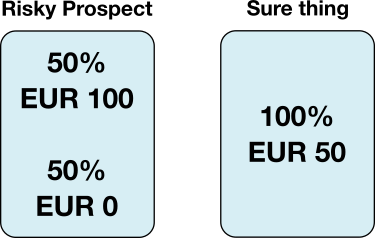
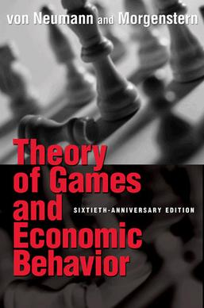
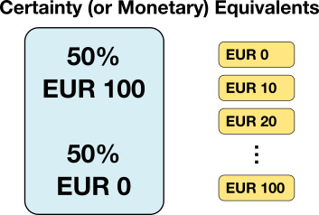
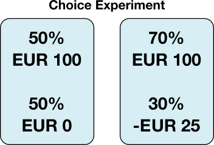

<br>
<p align="center">
    
</p>

<center>[Goran S. Milovanović, Phd](https://www.linkedin.com/in/gmilovanovic/)</center> 

<center>[DataKolektiv](https://www.datakolektiv.com/), Owner</center>

<center>[Smartocto](https://smartocto.com/), Senior Data Scientist</center> 


***
**Feedback** should be send to [goran.milovanovic@datakolektiv.com](mailto:goran.milovanovic@datakolektiv.com). 
These notebook accompanies the **BEHAVIORAL DECISION THEORY (BDT) EXPERIMENTAL DESIGN, MODEL ESTIMATION AND SELECTION Data Science Conference 2022 Tech Tutorial**, 15. November 2022, 16:30 - 18:00 CET

## Setup

```{r echo=TRUE, results="hide", message=FALSE, warning=FALSE}
# - setup
data_dir <- paste0(getwd(), "/_data/")
meq_data_dir <- paste0(data_dir, "_meq/")
kt92_data_dir <- paste0(data_dir, "_kt92/")

# - libs
library(tidyverse)
library(scales)
library(plotly)
library(snowfall)
```

## Fundamental concepts in Behavioral Decision Theory

### Risk aversion and risk attitudes

<br>
<p align="center">
    
</p>
<br>

The risky prospect and the sure thing have the same expected value:

$$E[Risky Prospect] = E[X=100, p=.5;X=0, p=.5] = .5\times100 + .5\times0 = 50$$

$$E[Sure Thing] = 50$$

Why are people risk averse?

### Utility Functions

#### Utility Function of an individual decision maker in choice under risk

<br>
<p align="left">
    
</p>
<br>

Daniel Bernoulli, "*Specimen Theoriae Novae de Mensura Sortis*", *Comentarii Academiae Scientiarum Imperialis Petroolitanae*, Tomus V, 1738, pp. 175-192

Risk aversion follows as a consequences of the characteristics of the decision maker's utility function.

The power utility function:

$$u(x) = x^\rho$$
The decision maker is **risk averse** for $0 < \rho < 1$ and **risk seeking** for $\rho>1$; risk seeking is not seen as a rational risk attitude.


```{r echo = TRUE, warning=FALSE, message=FALSE, fig.width=6, fig.height=5.5}
# - power utility function over gains
x <- seq(1, 100, .1)
rho = .67
ux <- x^rho
ra_frame <- data.frame(value = x,
                       utility = ux)
ggplot(data = ra_frame,
       aes(x = value, y = utility)) + 
  geom_point(size = .25, color = "blue") +
  geom_segment(aes(x = 50, 
                   y = 0, 
                   xend = 50, 
                   yend = 50^rho),
               colour = "black",
               linetype = "dashed",
               size = .1) + 
  geom_segment(aes(x = 0, 
                   y = 50^rho, 
                   xend = 50, 
                   yend = 50^rho),
               colour = "black",
               linetype = "dashed",
               size = .1) + 
  geom_segment(aes(x = 100, 
                   y = 0, 
                   xend = 100, 
                   yend = 100^rho),
               colour = "black",
               linetype = "dashed",
               size = .1) + 
  geom_segment(aes(x = 0, 
                   y = 100^rho, 
                   xend = 100, 
                   yend = 100^rho),
               colour = "black",
               linetype = "dashed",
               size = .1) + 
  geom_segment(aes(x = 0, 
                   y = 100^rho, 
                   xend = 100, 
                   yend = 100^rho),
               colour = "black",
               linetype = "dashed",
               size = .1) + 
  geom_segment(aes(x = 0, 
                   y = (100^rho)/2, 
                   xend = 100, 
                   yend = (100^rho)/2),
               colour = "red",
               linetype = "dashed",
               size = .1) + 
  ggtitle("Power utility function, rho=.67, Risk Aversion") +
  theme_bw() + 
  theme(panel.border = element_blank()) + 
  theme(plot.title = element_text(hjust=.5, size = 10))
```

```{r echo = TRUE, warning=FALSE, message=FALSE, fig.width=6, fig.height=5.5}
# - power utility function over gains
x <- seq(1, 100, .1)
rho = 1.2
ux <- x^rho
ra_frame <- data.frame(value = x,
                       utility = ux)
ggplot(data = ra_frame,
       aes(x = value, y = utility)) + 
  geom_point(size = .25, color = "red") +
  geom_segment(aes(x = 50, 
                   y = 0, 
                   xend = 50, 
                   yend = 50^rho),
               colour = "black",
               linetype = "dashed",
               size = .1) + 
  geom_segment(aes(x = 0, 
                   y = 50^rho, 
                   xend = 50, 
                   yend = 50^rho),
               colour = "black",
               linetype = "dashed",
               size = .1) + 
  geom_segment(aes(x = 100, 
                   y = 0, 
                   xend = 100, 
                   yend = 100^rho),
               colour = "black",
               linetype = "dashed",
               size = .1) + 
  geom_segment(aes(x = 0, 
                   y = 100^rho, 
                   xend = 100, 
                   yend = 100^rho),
               colour = "black",
               linetype = "dashed",
               size = .1) + 
  geom_segment(aes(x = 0, 
                   y = 100^rho, 
                   xend = 100, 
                   yend = 100^rho),
               colour = "black",
               linetype = "dashed",
               size = .1) + 
  geom_segment(aes(x = 0, 
                   y = (100^rho)/2, 
                   xend = 100, 
                   yend = (100^rho)/2),
               colour = "red",
               linetype = "dashed",
               size = .1) + 
  ggtitle("Power utility function, rho=1.2, Risk Seeking") +
  theme_bw() + 
  theme(panel.border = element_blank()) + 
  theme(plot.title = element_text(hjust=.5, size = 10))
```

Daniel Bernoulli, 1738. People make choices under risk by following the principle of the **Maximum Expected Utility (MEU)**:

$$EU(Prospect) = \sum_{i=1}^{N}p_iu(x_i)$$

The approach was axiomatized in 1947. only by John von Neumann and Oskar Morgenstern in their "*Theory of Games and Economic Behavior*", by providing a set of axioms that introduce the *preference relation* and a proof of a representation theorem showing that any decision maker who obeys the axioms of rational choice is at the same time a EU maximizer (and *vice versa*). Since then: the *von Neumann-Morgenstern utility* (or *vNM Expected Utility Theory)*.

<br>
<p align="left">
    
</p>
<br>

#### Kahneman and Tversky's Reference-Dependent Utility Function

**People are risk seeking the domain of losses.**

Example. The "Asian disease" framing problem (Tversky & Kahneman, 1981):

> Imagine that the US is preparing for the outbreak of an unusual Asian disease, which is expected to kill 600 people. Two alternative programs to combat the disease have been proposed.

- Program A: 200 people will be saved (72% of participants expressed a preference for A).
- Program B: 1/3 probability that 600 people will be saved, and a 2/3 probability that no people will be saved.

This finding illustrates risk aversion in the domain of gains.

- Program C: 400 people will die (22% opted for C).
- Program D: 1/3 probability that nobody will die, and a 2/3 probability that 600 people will die.

This finding illustrates *risk seeking in the domain of losses*.

The Reference-Dependent Utility Function:

```{r echo = TRUE, warning=FALSE, message=FALSE, fig.width=6, fig.height=5.5}
# - power reference-dependent utility function over gains and losses
x <- seq(-100, 100, .1)
rho = .67
ux <- ifelse(x>=0, x^rho, -(-x)^rho)
ra_frame <- data.frame(value = x,
                       utility = ux)
ggplot(data = ra_frame,
       aes(x = value, y = utility)) + 
  geom_point(size = .25, color = "blue") + 
  geom_hline(yintercept=0, size = .1, colour = "black", linetype = "dashed") +
  geom_vline(xintercept=0, size = .1, colour = "black", linetype = "dashed") +
  ggtitle("Reference-Dependent Power Utility function, rho=.67") +
  theme_bw() + 
  theme(panel.border = element_blank()) + 
  theme(plot.title = element_text(hjust=.5, size = 10))
```

### Loss aversion

Kahneman, Knetch & Thaler experiment, 1991.

Half of the participants in the experimental study receive something for free at the beginning of the session, e.g. a beatiful cup

<br>
<p align="center">
    
</p>
<br>

For those who own the item: **place the offer**.

<p style="color:black;font-size:18px;">$7 and 12 cents</p>  

- For those who do not own the item: **place the bid**.

<p style="color:black;font-size:18px;">2$ and 87 cents</p>  

That would be a `r round(7.12/2.87,2)` ratio in favor of the offered priced.

We need another correction of the utility function. Enter Loss Aversion, $\lambda$:

```{r echo = TRUE, warning=FALSE, message=FALSE, fig.width=6, fig.height=5.5}
# - power reference-dependent utility function over gains and losses
x <- seq(-100, 100, .1)
rho = .67
lambda = 2.2
ux <- ifelse(x>=0, x^rho, -lambda*(-x)^rho)
ra_frame <- data.frame(value = x,
                       utility = ux)
ggplot(data = ra_frame,
       aes(x = value, y = utility)) + 
  geom_point(size = .25, color = "blue") + 
  geom_hline(yintercept=0, size = .1, colour = "black", linetype = "dashed") +
  geom_vline(xintercept=0, size = .1, colour = "black", linetype = "dashed") +
  ggtitle("Loss Averse Reference-Dependent Power Utility function, \nrho=.67, lambda=2.2") +
  theme_bw() + 
  theme(panel.border = element_blank()) + 
  theme(plot.title = element_text(hjust=.5, size = 10))
```

If $\lambda > 1$, we observe loss aversion; however, if $0<\lambda<1$, we observe **gain seeking**, and that happens in empirical settings more often than people think.

But there is more to it.

### Probability weighting

The **four-fold pattern of risk attitudes** (Kahneman & Tversky), e.g.

- If a risky prospect offers only a **5%** chance for EUR 100 and a 95% chance to win nothing – people tend to be **risk seeking** (i.e. asking for **more than EUR 5** in exchange for the lottery), *but*
- If a risky prospect offers a **95%** chance for EUR 100 and only a 5% chance to win nothing – people tend to be **risk averse** (i.e. asking **less than EUR 95**in exchange for the lottery);

and of course we observe the reflection effect in the domain of losses:

- If a risky prospect offers only a **5%** chance for a loss of EUR 100 and a 95% chance to lose nothing – people tend to be **risk averse** (i.e. offering **more than EUR 5** to avoid the risky event), *but*
- If a risky prospect offers a **95%** chance to lose EUR 100 and only a 5% chance to lose nothing – people tend to be **risk seeking** (i.e. offering **less than EUR 95** to avoid the risky event).

It is like if there was a **probability weighting function, w(p)** such that $w(p) > p$ for small $p$ and $w(p) < p$ for high $p$, with an inflection point somewhere. Many functional forms were proposed for $w(p)$; we will mention only the Prelec's one-paramater form (1988):

$$w(p)=exp(-(-ln(p))^\gamma)), 0<\gamma<1 $$

```{r echo = TRUE, warning=FALSE, message=FALSE, fig.width=6, fig.height=5.5}
# - Prelec's single-parameter probability weighting function
p_weight <- function(p, gamma) {
  wp <- exp(-(-log(p))^gamma)
  return(wp)
} 
p <- seq(0,1,.01)
gamma <- .65
wp <- p_weight(p, gamma)
wp_frame <- data.frame(probability = p,
                       w_p = wp)
ggplot(data = wp_frame,
       aes(x = probability, y = wp)) + 
  geom_path(size = .25, color = "blue", group=1) + 
  ggtitle("Prelec's one-parameter w(p), gamma=.65") +
  geom_segment(aes(x = 0, 
                   y = 0, 
                   xend = 1, 
                   yend = 1),
               colour = "black",
               linetype = "dashed",
               size = .1) +
  theme_bw() + 
  theme(panel.border = element_blank()) + 
  theme(plot.title = element_text(hjust=.5, size = 10))
```

### Prospect Theory

Finally,

$$u_g(x)=x^{\rho_g}$$

$$u_l(x)=-{\lambda}x^{\rho_l}$$

$$w_g(p)=exp(-(-ln(p_g))^{\gamma_g}))$$
$$w_l(p)=exp(-(-ln(p_l))^{\gamma_l}))$$

And then in the simplest case we have

$$PT_G(Prospect) = \sum_{i=1}^{N}w_g(p_i)u_g(x_i)$$

for gains and 

$$PT_L(Prospect) = \sum_{i=1}^{N}w_l(p_i)u_l(x_i)$$
for losses. For mixed prospects (i.e. lotteries including both gains and losses), we sum up the $PT()$ for the positive and the negative part:

$$PT_{MIXED}(Prospect) = PT_G(Prospect)+PT_L(Prospect)$$

## Measurement and Data

<br>
<p align="center">
    
</p>
<br>

<br>
<p align="center">
    
</p>
<br>

Inspect some Monetary Equivalents (MEq) data (Kahneman & Tversky, 1992):

```{r echo = TRUE, warning=FALSE, message=FALSE}
# - load some MEq experimental data
meq_data <- read.csv(paste0(kt92_data_dir, "kt92.csv"),
                     header = TRUE,
                     check.names = FALSE,
                     row.names = 1,
                     stringsAsFactors = FALSE)
# - percents to probability in meq_data
meq_data$p1 <- meq_data$p1/100
meq_data$p2 <- meq_data$p2/100
print(meq_data)
```


## Estimating the Expected Utility Theory (EUR) model via LS

Start simple: let's estimate the EUT parameter (there is only one: the power-utility $\rho$ exponent) via Least Squares.

### Utility function

`utility_power()` is our EUT utility function.

```{r echo = TRUE, warning=FALSE, message=FALSE}
# - power utility function
utility_power <- function(x, rho) {
  u <- x^rho
  return(u)
}
```

### Prediction

A function `eut_predict()` to predict monetary equivalents from a dataset via **EUT**:

```{r echo = TRUE, warning=FALSE, message=FALSE}
# - function: EUT predictions
eut_predict <- function(data, rho) {
  
  # - utility functions
  u1 <- ifelse(data$v1 >= 0,
               utility_power(data$v1, rho),
               -utility_power(-data$v1, rho)
               )
  u2 <- ifelse(data$v2 >= 0,
               utility_power(data$v2, rho),
               -utility_power(-data$v2, rho)
               )
  
  # - predictions: utility scale
  predictions <- data$p1*u1 + data$p2*u2
  
  # - predictions: value scale
  predictions <- ifelse(predictions >= 0,
                        predictions^(1/rho),
                        -((-predictions)^(1/rho)))
  
  # - output
  return(predictions)
  
}
```

**NOTE.** The `predictions: value scale` part of the code is very important, because we do not wish to make predictions on the utility scale but rather on the value (MEq) scale. So, let's not forget that

$$MEq = u(x)^{1/\rho}$$
for gains, and

$$MEq = -(u(-x)^{1/\rho})$$
for losses.

And test our predictions for $\rho=.76$:

```{r echo = TRUE, warning=FALSE, message=FALSE}
preds <- eut_predict(data = meq_data, rho = .76)
print(preds)
```

### SSE: objective 

Now the objective function `eut_sse()`: it computes the $SSE$ following the predictive pass of `eut_predict()`

```{r echo = TRUE, warning=FALSE, message=FALSE}
# - optimize the EUT model via LS
eut_sse <- function(params) {
  rho <- abs(params[1])
  preds <- eut_predict(meq_data, rho)
  sse = sum((meq_data$meq - preds)^2)
  return(sse)
}
```

Test for $\rho=.76$:

```{r echo = TRUE, warning=FALSE, message=FALSE}
eut_sse(params=.76)
```

### EUT model optimization 

And we want to minimize `eut_sse()` for the MEq dataset at hand. We will use Nelder-Mead with R `optim()`:

```{r echo = TRUE, warning=FALSE, message=FALSE}
# - random initial value
init_rho <- runif(1, 0, 1)
solution <- optim(par = init_rho, 
                  fn = eut_sse, 
                  method = "Nelder-Mead", 
                  control = list("maxit" = 10e6))
print(paste0("Estimated Rho of ", round(solution$par, 2)))
print(paste0("Convergence check: ", solution$convergence))
```

Now let's predict the observed MEqs from the estimated parameter:

```{r echo = TRUE, warning=FALSE, message=FALSE}
# - predict from the optimized EUT model
meq_data$eut_meq <- eut_predict(meq_data,
                                rho = solution$par)
print(meq_data)
```

And plot the predictions:

```{r echo = TRUE, warning=FALSE, message=FALSE}
# - plot predictions
ggplot(data = meq_data,
       aes(x = eut_meq, y = meq)) + 
  geom_smooth(method = "lm", size = .25, color = "red", se = FALSE) + 
  geom_point(size = 1.5, color = "black") + 
  geom_point(size = 1, color = "white") + 
  ggtitle(paste0("EUT, Estimated Rho of ", round(solution$par, 2))) +
  xlab("Predicted MEq") + 
  ylab("Observed MEq") + 
  theme_bw() + 
  theme(panel.border = element_blank()) + 
  theme(plot.title = element_text(hjust=.5, size = 10))
```

Let's run 100 optimizations to check if we are stuck in some local minimum only:

```{r echo=TRUE, warning=FALSE, message=FALSE}
# - many optimization runs
init_rho <- runif(100, 0, 1)

# - run
results <- lapply(init_rho, function(x) {
  
  # - optimization run
  optim_sol <- tryCatch(optim(par = x,
                              fn = eut_sse,
                              method = "Nelder-Mead",
                              control = list("maxit" = 10e6)),
                        error = function(condition) {
                          return(NULL)
                        })
  
  if (!is.null(optim_sol)) {
    
    # - predictions
    preds <- eut_predict(meq_data, rho = optim_sol$par)
    
    return(
      list(rho = optim_sol$par,
           sse = optim_sol$value,
           convergence = optim_sol$convergence,
           predictions = preds)
      )
    
  } else {
      
      return(
      list(rho = NULL,
           sse = NULL,
           convergence = NULL,
           predictions = NULL)
      )
    
  }
  
  
})

# - find best solution
sse_list <- sapply(results, function(x) x$sse)
best_run <- which.min(sse_list)[1]
print(paste0("Check convergence: ", results[[best_run]]$convergence))
estimated_rho <- results[[best_run]]$rho
optimal_predictions <- results[[best_run]]$predictions

# - plot predictions
plot_frame <- meq_data
meq_data$eut_meq <- optimal_predictions
ggplot(data = meq_data,
       aes(x = meq, y = eut_meq)) + 
  geom_smooth(method = "lm", size = .25, color = "red", se = FALSE) + 
  geom_point(size = 1.5, color = "black") + 
  geom_point(size = 1, color = "white") + 
  ggtitle(paste0("EUT, Estimated Rho of ", round(estimated_rho, 2))) +
  xlab("Predicted MEq") + 
  ylab("Observed MEq") + 
  theme_bw() + 
  theme(panel.border = element_blank()) + 
  theme(plot.title = element_text(hjust=.5, size = 10))
```

### EUT model error surface

The EUT model error surface from a sample of 100,000 random parameter values:

```{r echo=TRUE, warning=FALSE, message=FALSE}
# - sample parameters from a range for plotting purposes
sample_parameters <- data.frame(rho = runif(100000, 0, 1))
sample_parameters$sse <- sapply(sample_parameters$rho, eut_sse)
head(sample_parameters)
```

```{r echo=TRUE, warning=FALSE, message=FALSE}
ggplot(data = sample_parameters,
       aes(x = rho, y = sse)) + 
  geom_line(size = .25, color = "black", group=1) + 
  ggtitle("EUT Model Error Surface ") +
  xlab("Rho") + 
  ylab("SSE") + 
  theme_bw() + 
  theme(panel.border = element_blank()) + 
  theme(plot.title = element_text(hjust=.5, size = 10))
```

## Estimating the Expected Utility Theory (EUR) model via MLE

### Approach to MLE for EUT

For the Maximum-Likelihood Estimation (MLE) of EUT, let's assume the following:

- the decision maker computes the $u(x)$ internally, and the
- responds with $u(x)+Normal(\mu=0,\sigma)$, i.e. adding a random noise to their response.

Then we can obtain the likelihood of each MEq observation from $Normal(response-prediction, \sigma)$, estimating one additional response model parameter $\sigma$.

The function `eut_likelihood` returns the negative log-likelihood for a dataset given parameters $\rho,\sigma$:

```{r echo=TRUE, warning=FALSE, message=FALSE}
# - function: EUT model likelihood
eut_likelihood <- function(data, rho, sigma) {
  
  # - utility functions
  u1 <- ifelse(data$v1 >= 0,
               utility_power(data$v1, rho),
               -utility_power(-data$v1, rho)
               )
  u2 <- ifelse(data$v2 >= 0,
               utility_power(data$v2, rho),
               -utility_power(-data$v2, rho)
               )
  
  # - predictions: utility scale
  predictions <- data$p1*u1 + data$p2*u2
  
  # - predictions: value scale
  predictions <- ifelse(predictions >= 0,
                        predictions^(1/rho),
                        -((-predictions)^(1/rho)))
  
  # - likelihood
  # - assume that the decision maker computes 
  # - the utility of the gamble and its MEQ, and then
  # - responds with an added random noise of Normal(0, sigma)
  neg_loglike <- -sum(
    dnorm(predictions - data$meq, mean = 0, sd = sigma, log = TRUE)
  )

  # - output
  return(neg_loglike)
  
}
```

Test `eut_likelihood` for $\rho=.76$ and $\sigma=11$:

```{r echo=TRUE, warning=FALSE, message=FALSE}
nll <- eut_likelihood(data = meq_data, rho = .76, sigma = 11)
print(nll)
```

### The objective

Introduce the objective `eut_mle()` function

```{r echo=TRUE, warning=FALSE, message=FALSE}
# - optimize the EUT model via LS
eut_mle <- function(params) {
  rho <- abs(params[1])
  sigma <- abs(params[2])
  nll <- eut_likelihood(data = meq_data, rho, sigma)
  return(nll)
}
```

### Optimize EUT model

And optimize `eut_mle()` for `meq_data`:

```{r echo=TRUE, warning=FALSE, message=FALSE}
# - random initial value
init_rho <- runif(1, 0, 1)
init_sigma <- runif(1, 0, 1)
solution <- optim(par = c(init_rho, init_sigma), 
                  fn = eut_mle, 
                  method = "Nelder-Mead", 
                  control = list("maxit" = 10e6))
print(paste0("Estimated Rho of ", round(abs(solution$par[1]), 2)))
print(paste0("Estimated Sigma of ", round(abs(solution$par[2]), 2)))
print(paste0("Convergence check: ", solution$convergence))

# - predict from the optimized EUT model
meq_data$eut_meq <- eut_predict(meq_data,
                                rho = abs(solution$par[1]))

# - plot predictions
ggplot(data = meq_data,
       aes(x = meq, y = eut_meq)) + 
  geom_smooth(method = "lm", size = .25, color = "red", se = FALSE) + 
  geom_point(size = 1.5, color = "black") + 
  geom_point(size = 1, color = "white") + 
  ggtitle(paste0("EUT, Estimated Rho of ", round(abs(solution$par), 2))) +
  xlab("Predicted MEq") + 
  ylab("Observed MEq") + 
  theme_bw() + 
  theme(panel.border = element_blank()) + 
  theme(plot.title = element_text(hjust=.5, size = 10))
```

Check by 100 optimization runs:

```{r echo=TRUE, warning=FALSE, message=FALSE}
# - many optimization runs
init_pars <- lapply(1:100, function(x) {
  return(
    list(
      init_rho = runif(1, 0, 1),
      init_sigma = runif(1, 0, 1)
    )
  )
})

# - run
results <- lapply(init_pars, function(x) {
  
  init_rho <- x$init_rho
  init_sigma <- x$init_sigma
  
  # - optimization run
  optim_sol <- tryCatch(optim(par = c(init_rho, init_sigma),
                              fn = eut_mle,
                              method = "Nelder-Mead",
                              control = list("maxit" = 10e6)),
                        error = function(condition) {
                          return(NULL)
                        })
  
  if (!is.null(optim_sol)) {
    
    # - predictions
    preds <- eut_predict(meq_data, rho = abs(optim_sol$par[1]))

    return(
      list(rho = optim_sol$par[1],
           sigma = optim_sol$par[2],
           nll = optim_sol$value,
           convergence = optim_sol$convergence,
           predictions = preds)
      )
    
  } else {
      
      return(
      list(rho = NULL,
           sigma = NULL,
           nll = NULL,
           convergence = NULL,
           predictions = NULL)
      )
    
  }
  
  
})

# - find best solution
nll_list <- sapply(results, function(x) x$nll)
best_run <- which.min(nll_list)[1]
print(paste0("Check convergence: ", results[[best_run]]$convergence))
estimated_rho <- abs(results[[best_run]]$rho)
print(paste0("Estimated Rho: ", estimated_rho))
estimated_sigma <- abs(results[[best_run]]$sigma)
print(paste0("Estimated Sigma: ", estimated_sigma))
optimal_predictions <- results[[best_run]]$predictions

# - plot predictions
plot_frame <- meq_data
meq_data$eut_meq <- optimal_predictions
ggplot(data = meq_data,
       aes(x = meq, y = eut_meq)) + 
  geom_smooth(method = "lm", size = .25, color = "red", se = FALSE) + 
  geom_point(size = 1.5, color = "black") + 
  geom_point(size = 1, color = "white") + 
  ggtitle(paste0("EUT, Estimated Rho of ", round(estimated_rho, 2))) +
  xlab("Predicted MEq") + 
  ylab("Observed MEq") + 
  theme_bw() + 
  theme(panel.border = element_blank()) + 
  theme(plot.title = element_text(hjust=.5, size = 10))

```

### The EUT Negative Log-Likelihood surface

```{r echo=TRUE, warning=FALSE, message=FALSE}
# - sample parameters from a range for plotting purposes
sample_parameters <- data.frame(rho = runif(100000, 0, 1.5), 
                                sigma = runif(100000, 0, 15))
sample_parameters$nll <- apply(sample_parameters, 1, function(x) {
    eut_mle(params = c(x[1], x[2]))
})
head(sample_parameters)
```

```{r echo=TRUE, warning=FALSE, message=FALSE}
plot_ly() %>% 
  add_trace(data = sample_parameters,  
            x = sample_parameters$rho, 
            y = sample_parameters$sigma, 
            z = sample_parameters$nll, 
            type = "mesh3d", 
            intensity = sample_parameters$nll) %>% 
  layout(
    modebar = list(orientation = "v"), 
    title = "The EUT Negative Log-Likehood function",
    scene = list(
      xaxis = list(title = "Rho", range = c(0, 1.5)),
      yaxis = list(title = "Sigma", range = c(0, 15)),
      zaxis = list(title = "Neg-LogLike", range = c(0, 1000))
    )) %>% hide_colorbar()
```

## Estimating the (Cumulative) Prospect Theory (CPT) model via MLE

We will begin with a different, larger data set (Milovanovic, 2013):

```{r echo=TRUE, warning=FALSE, message=FALSE}
# - load some MEq experimental data
meq_data <- read.csv(paste0(meq_data_dir, "es4v1.csv"),
                     header = TRUE,
                     check.names = FALSE,
                     row.names = 1,
                     stringsAsFactors = FALSE)
# - percents to probability in meq_data
meq_data$p1 <- meq_data$p1/100
meq_data$p2 <- meq_data$p2/100
print(meq_data)
```

### The PT Reference-Dependent Power Utility Function

Enters `rd_utility_power()`:

```{r echo=TRUE, warning=FALSE, message=FALSE}
# - reference_dependent power utility function
rd_utility_power <- function(x, rho_g, rho_l, lambda) {
  u <- ifelse(x >= 0, 
              x^rho_g,
              -lambda*((-x)^rho_l))
  return(u)
}
```

### Probability Weighting Function

Enters `p_weight()`

```{r echo=TRUE, warning=FALSE, message=FALSE}
# - Prelec's single-parameter probability weighting function
# - NOTE: w(p) will be applied over gains and losses separately 
p_weight <- function(p, gamma) {
  
  wp <- exp(-(-log(p))^gamma)
  return(wp)

}
```

### The Prospect Theory Negative Log-Likelihood

### PT optimization and predictions

`cpt_likelihood()` returns the negative log-likelihood for a given dataset:

```{r echo=TRUE, warning=FALSE, message=FALSE}
# - function: CPT model likelihood
cpt_likelihood <- function(data, 
                           rho_g, 
                           rho_l, 
                           lambda, 
                           gamma_gain, 
                           gamma_loss,
                           sigma) {
  
  # - utility functions
  u1 <- rd_utility_power(data$v1, rho_g, rho_l, lambda)
  u2 <- rd_utility_power(data$v2, rho_g, rho_l, lambda)
  
  # - probability weighting
  wp1 <- vector(mode = "numeric", length = length(data$v1))
  ix_gain_1 <- which(data$v1 >= 0)
  wp1[ix_gain_1] <- p_weight(data$p1[ix_gain_1], gamma_gain)
  ix_loss_1 <- which(data$v1 < 0)
  wp1[ix_loss_1] <- p_weight(data$p1[ix_loss_1], gamma_loss)
  wp2 <- 1-wp1
  
  # - predictions: utility scale
  predictions <- wp1*u1 + wp2*u2
  
  # - predictions: value scale
  predictions <- ifelse(predictions >= 0,
                        predictions^(1/rho_g),
                        -(((-predictions)/lambda)^(1/rho_l))
                        )
  
  # - likelihood
  # - assume that the decision maker computes 
  # - the utility of the gamble and its MEQ, and then
  # - responds with an added random noise of Normal(0, sigma)
  neg_loglike <- -sum(
    dnorm(predictions - data$meq, mean = 0, sd = sigma, log = TRUE)
  )

  # - output
  return(neg_loglike)
  
}
```

Test `cpt_likelihood()` for a set of parameters:

```{r echo=TRUE, warning=FALSE, message=FALSE}
nll <- cpt_likelihood(data = meq_data, 
                      rho_g = .71, 
                      rho_l = .69, 
                      lambda = 2, 
                      gamma_gain = .67, 
                      gamma_loss = .61, 
                      sigma = .14)
print(nll)
```

And finally minimize `cpt_likelihood()` for `meq_data`:

```{r echo=TRUE, warning=FALSE, message=FALSE}
# - optimize the CPT model via LS
cpt_mle <- function(params) {
  rho_g <- abs(params[1])
  rho_l <- abs(params[2])
  lambda <- abs(params[3])
  gamma_gain <- abs(params[4])
  gamma_loss <- abs(params[5])
  sigma <- abs(params[6])
  nll <- cpt_likelihood(data = meq_data, 
                        rho_g, rho_l, lambda,
                        gamma_gain, gamma_loss, sigma)
  return(nll)
}

# - random initial value
init_rho_g <- runif(1, 0, 1)
init_rho_l <- runif(1, 0, 1)
init_lambda <- runif(1, 0, 10)
init_gamma_gain <- runif(1, 0, 10)
init_gamma_loss <- runif(1, 0, 1)
init_sigma <- runif(1, 0, 1)
solution <- optim(par = c(init_rho_g, 
                          init_rho_l,
                          init_lambda,
                          init_gamma_gain,
                          init_gamma_loss,
                          init_sigma), 
                  fn = cpt_mle, 
                  method = "Nelder-Mead", 
                  control = list("maxit" = 10e6))
print(paste0("Estimated Rho for gains of ", round(abs(solution$par[1]), 2)))
print(paste0("Estimated Rho for losses of ", round(abs(solution$par[2]), 2)))
print(paste0("Estimated Lambda (loss aversion) of ", round(abs(solution$par[3]), 2)))
print(paste0("Estimated Gamma for gains of ", round(abs(solution$par[4]), 2)))
print(paste0("Estimated Gamma for losses of ", round(abs(solution$par[5]), 2)))
print(paste0("Estimated Sigma of ", round(abs(solution$par[6]), 2)))
print(paste0("Convergence check: ", solution$convergence))
```

`cpt_predict()` predicts Monetary Equivalents for a given dataset:

```{r echo=TRUE, warning=FALSE, message=FALSE}
# - function: CPT model predictions
cpt_predict <- function(data,
                        rho_g, rho_l, lambda,
                        gamma_gain, gamma_loss) {
  
  # - utility functions
  u1 <- rd_utility_power(data$v1, rho_g, rho_l, lambda)
  u2 <- rd_utility_power(data$v2, rho_g, rho_l, lambda)
  
  # - probability weighting
  wp1 <- vector(mode = "numeric", length = length(data$v1))
  ix_gain_1 <- which(data$v1 >= 0)
  wp1[ix_gain_1] <- p_weight(data$p1[ix_gain_1], gamma_gain)
  ix_loss_1 <- which(data$v1 < 0)
  wp1[ix_loss_1] <- p_weight(data$p1[ix_loss_1], gamma_loss)
  wp2 <- 1-wp1
  
  # - predictions: utility scale
  predictions <- wp1*u1 + wp2*u2
  
  # - predictions: value scale
  predictions <- ifelse(predictions >= 0,
                        predictions^(1/rho_g),
                        -(((-predictions)/lambda)^(1/rho_l))
                        )
  
  # - output
  return(predictions)
  
}
```

**NOTE.** The `predictions: value scale` part of the code is very important, because we do not wish to make predictions on the utility scale but rather on the value (MEq) scale. So, let's not forget that **under Prospect Theory** we have:

$$MEq = u_g(x)^{1/\rho_g}$$
while for losßes we have

$$MEq = -((\frac{u_l(-x)}{\lambda})^{1/\rho_l})$$

Test `cpt_predict()`:

```{r echo=TRUE, warning=FALSE, message=FALSE}
# - predict from the optimized CPT model
meq_data$cpt_meq <- cpt_predict(data = meq_data,
                                rho_g = abs(solution$par[1]),
                                rho_l = abs(solution$par[2]),
                                lambda = abs(solution$par[3]),
                                gamma_gain = abs(solution$par[4]),
                                gamma_loss = abs(solution$par[5])
                                )

# - plot predictions
ggplot(data = meq_data,
       aes(x = meq, y = cpt_meq)) + 
  geom_smooth(method = "lm", size = .25, color = "red", se = FALSE) + 
  geom_point(size = 1.5, color = "black") + 
  geom_point(size = 1, color = "white") + 
  ggtitle("CPT") +
  xlab("Predicted MEq") + 
  ylab("Observed MEq") + 
  theme_bw() + 
  theme(panel.border = element_blank()) + 
  theme(plot.title = element_text(hjust=.5, size = 10))
```

Run 1,000 optimizations (in parallel, using `snowfall`):

```{r echo=TRUE, warning=FALSE, message=FALSE}
# - init cloud
sfInit(parallel = TRUE, cpus = 23)

# - export
sfExport("meq_data")
sfExport("cpt_mle")
sfExport("cpt_predict")
sfExport("cpt_likelihood")
sfExport("p_weight")
sfExport("rd_utility_power")

# - many optimization runs
init_pars <- lapply(1:1000, function(x) {
  return(
    list(
      init_rho_g = runif(1, 0, 1),
      init_rho_l = runif(1, 0, 1),
      init_lambda = runif(1, 0, 1),
      init_gamma_gain = runif(1, 0, 1),
      init_gamma_loss = runif(1, 0, 1),
      init_sigma = runif(1, 0, 1)
    )
  )
})


# - run
results <- sfClusterApplyLB(init_pars, function(x) {
  
  init_rho_g <- x$init_rho_g
  init_rho_l = x$init_rho_l
  init_lambda = x$init_lambda
  init_gamma_gain = x$init_gamma_gain
  init_gamma_loss = x$init_gamma_loss
  init_sigma <- x$init_sigma
        
  # - optimization run
  optim_sol <- tryCatch(optim(par = c(init_rho_g,
                                      init_rho_l,
                                      init_lambda,
                                      init_gamma_gain,
                                      init_gamma_loss,
                                      init_sigma),
                              fn = cpt_mle,
                              method = "Nelder-Mead",
                              control = list("maxit" = 1e5,
                                             "reltol" = 1e-14)),
                        error = function(condition) {
                          return(NULL)
                        })
  
  if (!is.null(optim_sol)) {
    
    # - predictions
    preds <- cpt_predict(meq_data, 
                         rho_g = abs(optim_sol$par[1]),
                         rho_l = abs(optim_sol$par[2]),
                         lambda = abs(optim_sol$par[3]),
                         gamma_gain = abs(optim_sol$par[4]),
                         gamma_loss = abs(optim_sol$par[5])
                         )
    
    return(
      list(rho_g = abs(optim_sol$par[1]),
           rho_l = abs(optim_sol$par[2]),
           lambda = abs(optim_sol$par[3]),
           gamma_gain = abs(optim_sol$par[4]),
           gamma_loss = abs(optim_sol$par[5]),
           sigma = abs(optim_sol$par[6]),
           nll = optim_sol$value,
           convergence = optim_sol$convergence,
           predictions = preds)
      )
    
  } else {
      
      return(
      list(rho = NULL,
           sigma = NULL,
           nll = NULL,
           convergence = NULL,
           predictions = NULL)
      )
    
  }
  
  
})

# - stop cluster
sfStop()

# - filter out possible degenerative Nelder-Mead solutions
conv_list <- sapply(results, function(x) x$convergence)
degenerate <- which(conv_list != 0)
nll_list <- nll_list[-degenerate]
# - find best solution
nll_list <- sapply(results, function(x) x$nll)
best_run <- which.min(nll_list)[1]
print(paste0("Check convergence: ", results[[best_run]]$convergence))
estimated_rho_g <- results[[best_run]]$rho_g
print(paste0("Estimated Rho for gains: ", round(estimated_rho_g,2)))
estimated_rho_l <- results[[best_run]]$rho_l
print(paste0("Estimated Rho for losses: ", round(estimated_rho_l,2)))
estimated_lambda <- results[[best_run]]$lambda
print(paste0("Estimated Lambda (loss aversion): ", round(estimated_lambda,2)))
estimated_gamma_gain <- results[[best_run]]$gamma_gain
print(paste0("Estimated Gamma for gains: ", round(estimated_gamma_gain,2)))
estimated_gamma_loss <- results[[best_run]]$gamma_loss
print(paste0("Estimated Gamma for losses: ", round(estimated_gamma_loss,2)))
estimated_sigma <- results[[best_run]]$sigma
print(paste0("Estimated Sigma: ", round(estimated_sigma,2)))
nll <- results[[best_run]]$nll
print(paste0("Negative LogLikelihood: ", round(nll,2)))
optimal_predictions <- results[[best_run]]$predictions

# - plot predictions
plot_frame <- meq_data
meq_data$cpt_meq <- optimal_predictions
ggplot(data = meq_data,
       aes(x = meq, y = cpt_meq)) + 
  geom_smooth(method = "lm", size = .25, color = "red", se = FALSE) + 
  geom_point(size = 1.5, color = "black") + 
  geom_point(size = 1, color = "white") + 
  ggtitle("CPT") +
  xlab("Observed MEq") + 
  ylab("Predicted MEq") + 
  theme_bw() + 
  theme(panel.border = element_blank()) + 
  theme(plot.title = element_text(hjust=.5, size = 10))
```

## PT optimization for the KT92 data set

**NOTE.** There are no mixed-prospects in the `kt92.csv` data set:

```{r echo=TRUE, warning=FALSE, message=FALSE}
# - load some MEq experimental data
meq_data <- read.csv(paste0(kt92_data_dir, "kt92.csv"),
                     header = TRUE,
                     check.names = FALSE,
                     row.names = 1,
                     stringsAsFactors = FALSE)
# - percents to probability in meq_data
meq_data$p1 <- meq_data$p1/100
meq_data$p2 <- meq_data$p2/100
print(meq_data)
```

Run 1,000 optimizations for the `KT92` data set:

```{r echo=TRUE, warning=FALSE, message=FALSE}
# - init cloud
sfInit(parallel = TRUE, cpus = 23)

# - export
sfExport("meq_data")
sfExport("cpt_mle")
sfExport("cpt_predict")
sfExport("cpt_likelihood")
sfExport("p_weight")
sfExport("rd_utility_power")

# - many optimization runs
init_pars <- lapply(1:1000, function(x) {
  return(
    list(
      init_rho_g = runif(1, 0, 1),
      init_rho_l = runif(1, 0, 1),
      init_lambda = runif(1, 0, 1),
      init_gamma_gain = runif(1, 0, 1),
      init_gamma_loss = runif(1, 0, 1),
      init_sigma = runif(1, 0, 1)
    )
  )
})


# - run
results <- sfClusterApplyLB(init_pars, function(x) {
  
  init_rho_g <- x$init_rho_g
  init_rho_l = x$init_rho_l
  init_lambda = x$init_lambda
  init_gamma_gain = x$init_gamma_gain
  init_gamma_loss = x$init_gamma_loss
  init_sigma <- x$init_sigma
        
  # - optimization run
  optim_sol <- tryCatch(optim(par = c(init_rho_g,
                                      init_rho_l,
                                      init_lambda,
                                      init_gamma_gain,
                                      init_gamma_loss,
                                      init_sigma),
                              fn = cpt_mle,
                              method = "Nelder-Mead",
                              control = list("maxit" = 1e5,
                                             "reltol" = 1e-14)),
                        error = function(condition) {
                          return(NULL)
                        })
  
  if (!is.null(optim_sol)) {
    
    # - predictions
    preds <- cpt_predict(meq_data, 
                         rho_g = abs(optim_sol$par[1]),
                         rho_l = abs(optim_sol$par[2]),
                         lambda = abs(optim_sol$par[3]),
                         gamma_gain = abs(optim_sol$par[4]),
                         gamma_loss = abs(optim_sol$par[5])
                         )
    
    return(
      list(rho_g = abs(optim_sol$par[1]),
           rho_l = abs(optim_sol$par[2]),
           lambda = abs(optim_sol$par[3]),
           gamma_gain = abs(optim_sol$par[4]),
           gamma_loss = abs(optim_sol$par[5]),
           sigma = abs(optim_sol$par[6]),
           nll = optim_sol$value,
           convergence = optim_sol$convergence,
           predictions = preds)
      )
    
  } else {
      
      return(
      list(rho_g = NULL,
           rho_l = NULL,
           lambda = NULL,
           gamma_gain = NULL,
           gamma_loss = NULL,
           sigma = NULL,
           nll = NULL,
           convergence = NULL,
           predictions = NULL)
      )
    
  }
  
  
})

# - stop cluster
sfStop()

# - filter out possible degenerative Nelder-Mead solutions
conv_list <- sapply(results, function(x) x$convergence)
degenerate <- which(conv_list != 0)
nll_list <- nll_list[-degenerate]
# - find best solution
nll_list <- sapply(results, function(x) x$nll)
best_run <- which.min(nll_list)[1]
print(paste0("Check convergence: ", results[[best_run]]$convergence))
estimated_rho_g <- results[[best_run]]$rho_g
print(paste0("Estimated Rho for gains: ", round(estimated_rho_g,2)))
estimated_rho_l <- results[[best_run]]$rho_l
print(paste0("Estimated Rho for losses: ", round(estimated_rho_l,2)))
estimated_lambda <- results[[best_run]]$lambda
print(paste0("Estimated Lambda (loss aversion): ", round(estimated_lambda,2)))
estimated_gamma_gain <- results[[best_run]]$gamma_gain
print(paste0("Estimated Gamma for gains: ", round(estimated_gamma_gain,2)))
estimated_gamma_loss <- results[[best_run]]$gamma_loss
print(paste0("Estimated Gamma for losses: ", round(estimated_gamma_loss,2)))
estimated_sigma <- results[[best_run]]$sigma
print(paste0("Estimated Sigma: ", round(estimated_sigma,2)))
nll <- results[[best_run]]$nll
print(paste0("Negative LogLikelihood: ", round(nll,2)))
optimal_predictions <- results[[best_run]]$predictions

# - plot predictions
plot_frame <- meq_data
meq_data$cpt_meq <- optimal_predictions
ggplot(data = meq_data,
       aes(x = meq, y = cpt_meq)) + 
  geom_smooth(method = "lm", size = .25, color = "red", se = FALSE) + 
  geom_point(size = 1.5, color = "black") + 
  geom_point(size = 1, color = "white") + 
  ggtitle("CPT") +
  xlab("Observed MEq") + 
  ylab("Predicted MEq") + 
  theme_bw() + 
  theme(panel.border = element_blank()) + 
  theme(plot.title = element_text(hjust=.5, size = 10))
```

**NOTE.** $\lambda$, the Loss Aversion parameter, cannot be estimated from experimental designs that do not encompass **mixed lotteries**.

## Model selection: plan for K-fold CV

```{r echo=TRUE, warning=FALSE, message=FALSE}
# - load some MEq experimental data
meq_data <- read.csv(paste0(meq_data_dir, "es4v1.csv"),
                     header = TRUE,
                     check.names = FALSE,
                     row.names = 1,
                     stringsAsFactors = FALSE)
# - percents to probability in meq_data
meq_data$p1 <- meq_data$p1/100
meq_data$p2 <- meq_data$p2/100
print(meq_data)
```

### Types of lotteries

```{r echo=TRUE, warning=FALSE, message=FALSE}
# - types of lotteries
# - strictly positive
pos_lott <- which(meq_data$v1 > 0 & meq_data$v2 > 0)
print(paste0("There are ", length(pos_lott), " strictly POSITIVE lotteries."))
# - non-negative
nneg_lott <- which ( 
  (meq_data$v1 > 0 & meq_data$v2 == 0) |
    (meq_data$v1 == 0 & meq_data$v2 > 0)
)
print(paste0("There are ", length(nneg_lott), " NON-NEGATIVE lotteries."))
# - strictly negative
neg_lott <- which(meq_data$v1 < 0 & meq_data$v2 < 0)
print(paste0("There are ", length(neg_lott), " strictly NEGATIVE lotteries."))
# - non-positive
npos_lott <- which ( 
  (meq_data$v1 < 0 & meq_data$v2 == 0) |
    (meq_data$v1 == 0 & meq_data$v2 < 0)
)
print(paste0("There are ", length(npos_lott), " NON-POSITIVE lotteries."))
# - mixed
mixed_lott <- which ( 
  (meq_data$v1 < 0 & meq_data$v2 > 0) |
    (meq_data$v1 > 0 & meq_data$v2 < 0)
)
print(paste0("There are ", length(mixed_lott), " MIXED lotteries."))

```

Let's enter `type` to `meq_data`:

```{r echo=TRUE, warning=FALSE, message=FALSE}
meq_data$type <- apply(meq_data, 1, function(x) {
  if (x[2] > 0 & x[4] > 0) {
    return("p")
  } else if ((x[2] > 0 & x[4] == 0) | 
             (x[2] == 0 & x[4] > 0)) {
    return("nn")
  } else if (x[2] < 0 & x[4] < 0) {
    return("n")
  } else if ((x[2] < 0 & x[4] == 0) |
    (x[2] == 0 & x[4] < 0)) {
    return("np")
  } else {
    return("mixed")
  }
})
table(meq_data$type)
```

You need to make sure that all types of lotteries enter all of your folds in k-fold cross-validation of this model.

### Folds plan

```{r echo=TRUE, warning=FALSE, message=FALSE}
meq_data$fold <- 0
types <- unique(meq_data$type)
for (i in 1:length(types)) {
  w <- which(meq_data$type == types[i])
  f_asgn <- rep(1:5, length(w)/5)
  f_asgn <- sample(f_asgn, size = length(f_asgn), replace = FALSE)
  meq_data$fold[w] <- f_asgn
}
print(meq_data)
```

Check:

```{r echo=TRUE, warning=FALSE, message=FALSE}
table(meq_data$fold, meq_data$type)
```

***
Goran S. Milovanović

DataKolektiv, 2022.

contact: goran.milovanovic@datakolektiv.com


***
License: [GPLv3](http://www.gnu.org/licenses/gpl-3.0.txt)
This Notebook is free software: you can redistribute it and/or modify it under the terms of the GNU General Public License as published by the Free Software Foundation, either version 3 of the License, or (at your option) any later version.
This Notebook is distributed in the hope that it will be useful, but WITHOUT ANY WARRANTY; without even the implied warranty of MERCHANTABILITY or FITNESS FOR A PARTICULAR PURPOSE.  See the GNU General Public License for more details.
You should have received a copy of the GNU General Public License along with this Notebook. If not, see <http://www.gnu.org/licenses/>.

***

